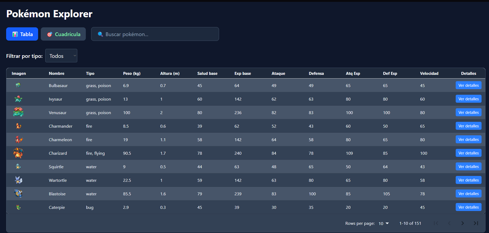
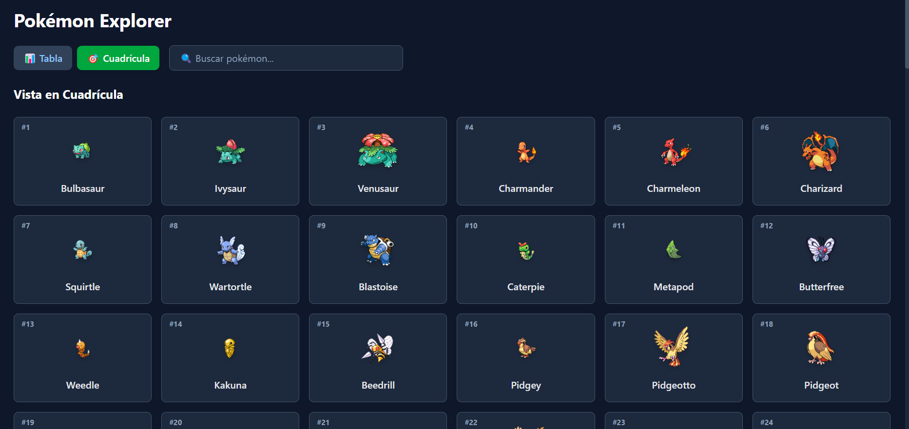
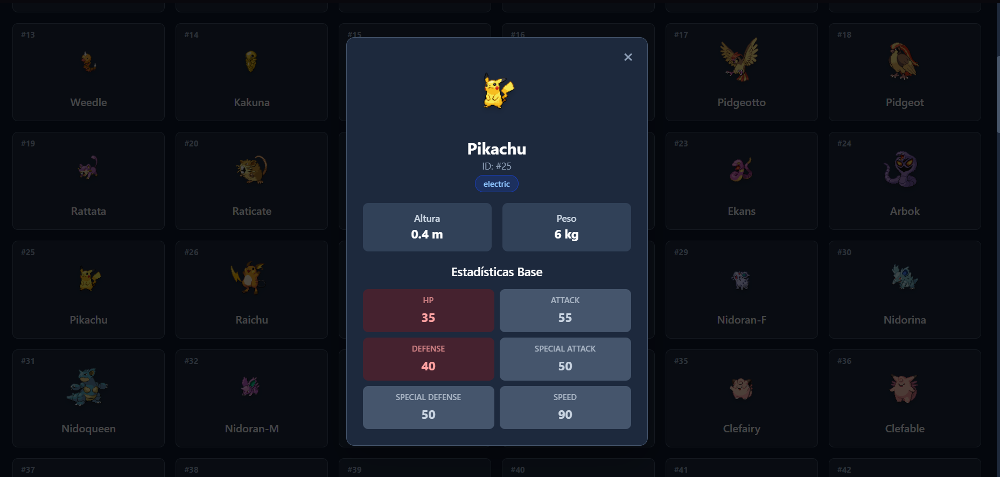

# Pokemon Explorer 🌟

Una aplicación web moderna para explorar y descubrir Pokémon, construida con React, TypeScript y Tailwind CSS. La aplicación consume la PokéAPI para mostrar información detallada de los Pokémon en dos vistas diferentes: cuadrícula y tabla.





## 🚀 Demo en Vivo

[Ver Demo](https://tu-usuario.github.io/pokemon-explorer/)

## ✨ Características

- **Vista de Cuadrícula**: Explora Pokémon en tarjetas con imágenes y información básica
- **Vista de Tabla**: Visualiza datos de Pokémon en formato tabular compacto
- **Modal Detallado**: Información completa de cada Pokémon al hacer clic
- **Tema Oscuro**: Interfaz moderna con diseño dark elegante
- **Responsive**: Adaptable a diferentes tamaños de pantalla
- **TypeScript**: Tipado estático para mejor desarrollo
- **Rendimiento Optimizado**: Carga eficiente de datos con React hooks

## 🛠️ Tecnologías Utilizadas

- **React 18** - Biblioteca de interfaz de usuario
- **TypeScript** - Tipado estático para JavaScript
- **Tailwind CSS** - Framework de CSS utilitario
- **Vite** - Herramienta de construcción rápida
- **PokéAPI** - API REST para datos de Pokémon

## 🏗️ Instalación y Uso Local

### Prerrequisitos

- Node.js (versión 16 o superior)
- npm o yarn

### Pasos para ejecutar localmente

1. **Clona el repositorio**
   ```bash
   git clone https://github.com/tu-usuario/pokemon-explorer.git
   cd pokemon-explorer
   ```

2. **Instala las dependencias**
   ```bash
   npm install
   ```

3. **Ejecuta el servidor de desarrollo**
   ```bash
   npm run dev
   ```

4. **Abre tu navegador**
   - Ve a `http://localhost:5173`
   - ¡Disfruta explorando Pokémon! 🎉

### Comandos Disponibles

```bash
npm run dev          # Inicia el servidor de desarrollo
npm run build        # Construye la aplicación para producción
npm run preview      # Previsualiza la construcción de producción
npm run lint         # Ejecuta ESLint para verificar el código
npm run deploy       # Despliega a GitHub Pages
```

## 📂 Estructura del Proyecto

```
src/
├── components/           # Componentes reutilizables
│   ├── PokemonCard.tsx  # Tarjeta individual de Pokémon
│   └── PokemonModal.tsx # Modal con información detallada
├── pages/               # Páginas principales
│   ├── GridView.tsx     # Vista de cuadrícula
│   └── TableView.tsx    # Vista de tabla
├── hooks/               # Custom hooks
│   └── usePokemonData.ts # Hook para manejar datos de Pokémon
├── types/               # Definiciones de TypeScript
│   └── pokemon.ts       # Tipos de datos de Pokémon
├── App.tsx             # Componente principal
└── main.tsx           # Punto de entrada
```

## 🎨 Características del Diseño

- **Tema Oscuro Elegante**: Colores cuidadosamente seleccionados para una experiencia visual agradable
- **Animaciones Suaves**: Transiciones y hover effects para mejor UX
- **Tipografía Moderna**: Fuentes legibles y jerárquicas
- **Componentes Responsivos**: Diseño que se adapta a móviles, tablets y desktop

## 🚀 Despliegue

Este proyecto está configurado para desplegarse automáticamente en GitHub Pages:

1. **Configura el repositorio en GitHub**
2. **Ejecuta el comando de despliegue**
   ```bash
   npm run deploy
   ```
3. **Configura GitHub Pages** en la configuración del repositorio para usar la rama `gh-pages`

## 🤝 Contribuciones

Las contribuciones son bienvenidas. Para contribuir:

1. Fork el proyecto
2. Crea una rama para tu feature (`git checkout -b feature/AmazingFeature`)
3. Commit tus cambios (`git commit -m 'Add some AmazingFeature'`)
4. Push a la rama (`git push origin feature/AmazingFeature`)
5. Abre un Pull Request

## 📝 Licencia

Este proyecto está bajo la licencia MIT. Ver el archivo `LICENSE` para más detalles.

## 👨‍💻 Autor

**Juan Jose Sierra Arroyave**
- GitHub: [@tu-usuario](https://github.com/tu-usuario)
- LinkedIn: [tu-perfil](https://linkedin.com/in/tu-perfil)

## 🙏 Agradecimientos

- [PokéAPI](https://pokeapi.co/) por proporcionar datos gratuitos de Pokémon
- [Tailwind CSS](https://tailwindcss.com/) por el excelente framework de CSS
- [React](https://reactjs.org/) por la increíble biblioteca de UI

---

⭐ Si te gusta este proyecto, ¡dale una estrella en GitHub!
  {
    files: ['**/*.{ts,tsx}'],
    extends: [
      // Other configs...
      // Enable lint rules for React
      reactX.configs['recommended-typescript'],
      // Enable lint rules for React DOM
      reactDom.configs.recommended,
    ],
    languageOptions: {
      parserOptions: {
        project: ['./tsconfig.node.json', './tsconfig.app.json'],
        tsconfigRootDir: import.meta.dirname,
      },
      // other options...
    },
  },
])
```
